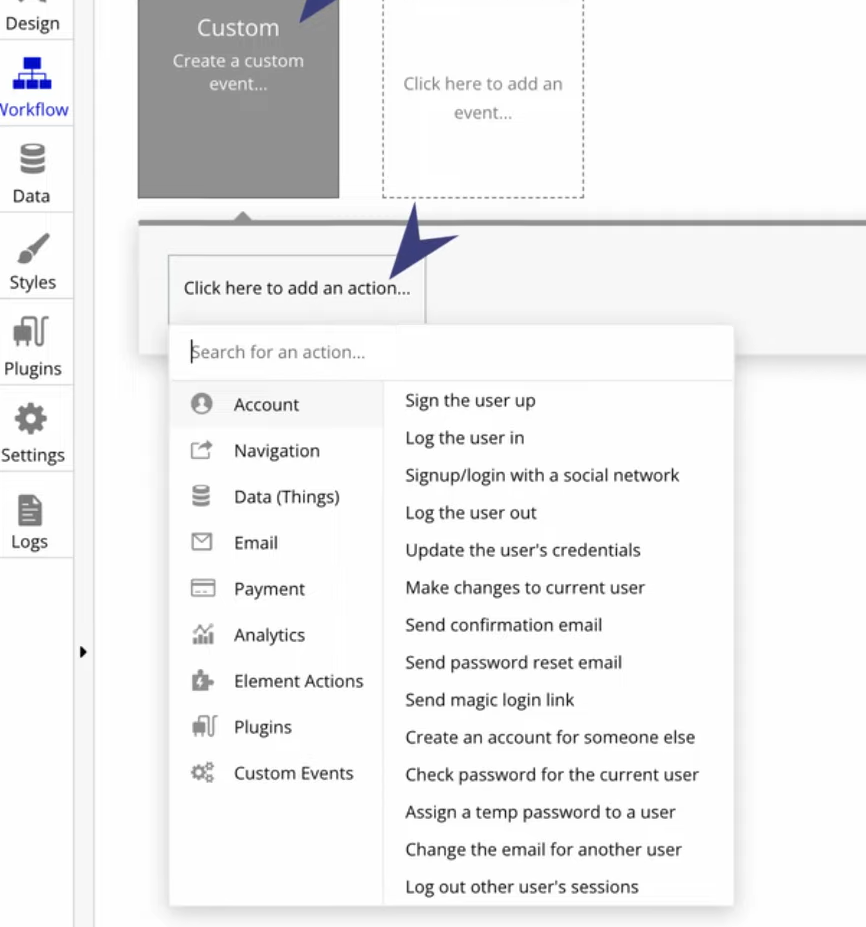

# Bubble No-Code Notes

Screenshot-based study notes on building web applications with the Bubble no-code platform: UI elements, data types, workflows, privacy rules and deployment.

## Overview

This repository collects screenshots taken while learning [Bubble](https://bubble.io), a visual platform for building web apps without writing code. Each image is named after the concept it illustrates, so the file list works as a topic index. The repository contains no application code or exported Bubble project.

## Contents

| Topic | Files |
| --- | --- |
| UI design | `visual_elements_for_ui.png`, `property_editor_duble_click_item.png`, `property_editor_duble_click_item_2.png`, `saving_element_designs_for_whole_app.png`, `responsive_design_for_different_screens.png` |
| Data types | `build_in_user_datatype.png`, `creating_datatype_1.png`, `creating_datatype_2.png`, `connecting_datatypes_1.png`, `connecting_datatypes_2.png`, `parent_child_data_hierarchy.png` |
| Dynamic data and data sources | `inserting_dynamic_data_1.png`, `inserting_dynamic_data_2.png`, `type_of_content_and_data_source.png`, `current_user_datasource.png`, `repeating_group_(list_of_same_datatype).png` |
| Database | `using_database.png`, `dev_mode_vs_live_mode_for_database.png`, `dev_mode_vs_live_mode_different_database.png` |
| Workflows | `workflow_for_no_code_1.png`, `workflow_for_no_code_2.png` |
| Security and privacy | `security_of_app.png`, `defining_privacy_rule_(security).png` |
| Tools and platform | `debugger.png`, `plugins.png`, `bubble_servers.png` |

Example: adding an action to a workflow (`workflow_for_no_code_1.png`)

## Repository structure

All 26 images are in the repository root and are grouped by topic in the table above.

## Tech stack

- Bubble (no-code web application platform)

## Author

Goktug Can Simay: [GitHub](https://github.com/simaygoktug) | [Website](https://goktugcansimay.com)
